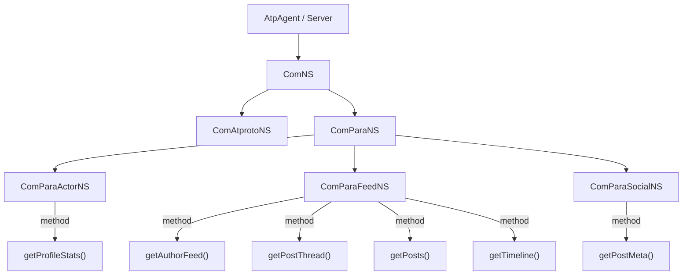

# Lexicon Namespace (NS) Classes

## What does "NS" mean?

**NS = Namespace.** The `*NS` classes are auto-generated TypeScript wrappers that mirror the dot-separated lexicon NSID hierarchy as a nested object tree, giving you type-safe method calls instead of raw string-based XRPC invocations.

## The Problem They Solve

Without NS classes you'd call endpoints with raw strings:

```ts
// ❌ No type safety — typos and wrong params compile fine
client.call('com.para.feed.getAutherFeed', { actor: 'alice' })
```

With NS classes the lexicon tree is modeled as nested objects:

```ts
// ✅ Fully typed — autocomplete, compile-time checks
client.com.para.feed.getAuthorFeed({ actor: 'alice' })
```

## How the Hierarchy Maps

Every dot segment in a Lexicon NSID becomes a nested NS class:

```
com.para.feed.getAuthorFeed
 │    │    │         └─ method on ComParaFeedNS
 │    │    └─ ComParaFeedNS (feed: ComParaFeedNS)
 │    └─ ComParaNS       (para: ComParaNS)
 └─ ComNS               (com: ComNS)
```



## Client vs Server NS Classes

The NS classes exist in both packages but serve different roles:

### `@atproto/api` (Client)

Each method wraps `this._client.call(nsid, params, data, opts)` and returns a typed `Promise<Response>`.

```ts
// packages/api/src/client/index.ts
export class ComParaFeedNS {
  _client: XrpcClient

  getAuthorFeed(
    params: ComParaFeedGetAuthorFeed.QueryParams,
    opts?: ComParaFeedGetAuthorFeed.CallOptions,
  ): Promise<ComParaFeedGetAuthorFeed.Response> {
    return this._client.call(
      'com.para.feed.getAuthorFeed',
      params,
      undefined,
      opts,
    )
  }
}
```

### `@atproto/pds` (Server)

Each method registers an XRPC handler via `this._server.xrpc.method(nsid, cfg)`.

```ts
// packages/pds/src/lexicon/index.ts
export class ComParaFeedNS {
  _server: Server

  getAuthorFeed<A extends Auth = void>(
    cfg: MethodConfigOrHandler<
      A,
      ComParaFeedGetAuthorFeed.QueryParams,
      ComParaFeedGetAuthorFeed.HandlerInput,
      ComParaFeedGetAuthorFeed.HandlerOutput
    >,
  ) {
    const nsid = 'com.para.feed.getAuthorFeed'
    return this._server.xrpc.method(nsid, cfg)
  }
}
```

## Record Classes

Record types (like `com.para.post`, `com.para.status`) get a `*Record` class instead of a method. These wrap the generic `com.atproto.repo.*` CRUD operations with the correct `collection` string pre-filled:

```ts
export class ComParaPostRecord {
  async list(params) // → repo.listRecords({ collection: 'com.para.post', ...params })
  async get(params) // → repo.getRecord({ collection: 'com.para.post', ...params })
  async create(params) // → repo.createRecord({ collection: 'com.para.post', ...params })
  async put(params) // → repo.putRecord({ collection: 'com.para.post', ...params })
  async delete(params) // → repo.deleteRecord({ collection: 'com.para.post', ...params })
}
```

## Where They Live

| Package         | File                                 | Role                   |
| --------------- | ------------------------------------ | ---------------------- |
| `@atproto/api`  | `packages/api/src/client/index.ts`   | Client-side NS classes |
| `@atproto/pds`  | `packages/pds/src/lexicon/index.ts`  | Server-side NS classes |
| `@atproto/bsky` | `packages/bsky/src/lexicon/index.ts` | Server-side NS classes |

> **Note:** These classes are generated code. The source of truth is the lexicon schema definitions in `lexicons.ts`. If you add a new `com.para.*` lexicon, you must regenerate or manually add the corresponding NS class in all 3 packages.
