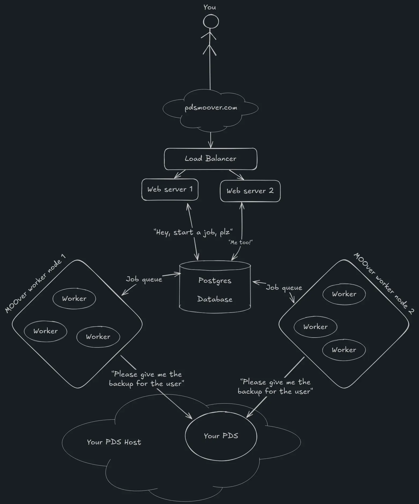

# PDS MOOver: The Next Generation

A series of web tools to help users: migrate to a new PDS, find missing blobs, have free backups, and restore from
backups in the event of emergency. [pdsmoover.com](https://pdsmoover.com)

A little light on documentation as I come off of about a week long crunch but.

- Looking for the old pds moover for simple code to fork
  check [here](https://tangled.org/@baileytownsend.dev/pds-moover/tree/803d8a70b7100c9e14df3402277441050e0f6194), if
  you'd like to see the newer front end check [here](./web-ui)
- Want to run your own instance of PDS MOOver? [check this docker compose](./compose.selfhost.yml). It should have all
  the
  services in one easy `docker compose up`, just don't forget to create a `.env` from [.env.template](.env.template)

## Break down of projects from the top

A bit of a mess will probably either condense or rename a couple of these to make it more coherent in the future

- [admin_cli](./admin_cli) - Like pdsadmin, but for pds moover. Can add a whole PDS to be tracked and their users backed
  up, remove users, etc. VERY WIP and not everything there yet
- [cron-worker](./cron-worker) - Very simple binary to tick every hour telling the main worker to check for repos that
  need an update
- [Dockerfiles](./Dockerfiles) - Dockerfiles for all the services in the repo
- [packages/lexicons](./packages/lexicons) - TypeScript types for PDS MOOver lexicons
- [packages/moover](./packages/moover) - Frontend logic that handles all the atproto processes. Also published as a node
  module
  at [@pds-moover/moover](https://www.npmjs.com/package/@pds-moover/moover)
- [lexicon_types_crate](./lexicon_types_crate) - Rust lexicon types
- [lexicons](./lexicons) - JSON Lexicons
- [ProductionComposes](./ProductionComposes) - What I use to run PDS MOOver in production. One instance of web behind a
  load balancer, one worker node currently with 3 instances on that one server. All can scale horizontally
- [shared](./shared) - Shared code between all the services
- [web](./web) - The web frontend that servers XRPC endpoints and the frontend
- [web-ui](./web-ui) - Svelte frontend.
  plc ops, restores, etc
- [worker](./worker) - What acutally handles all the backing up, but the actual logic is
  in [./shared/src/jobs/](./shared/src/jobs/)

I think there's everything?

## Do you have a pretty picture to show how the network looks?

yes. Thanks to [Orual](https://bsky.app/profile/nonbinary.computer)
